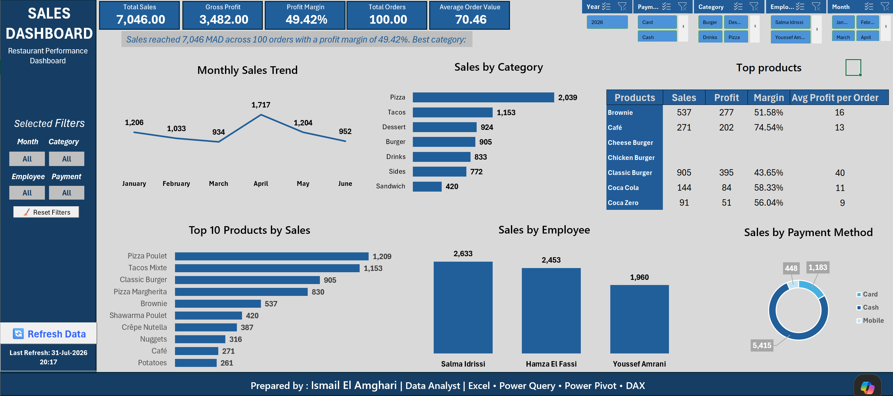

# 🍽️ Restaurant Sales Dashboard

An interactive Business Intelligence dashboard built in Microsoft Excel.

---

## Dashboard Preview



---

## Data Model


---

## Sales Analysis


# 🍽️ Restaurant Sales Dashboard

> An interactive Excel-based Business Intelligence dashboard for restaurant sales analysis, built using Power Query, Power Pivot, DAX, CUBE Functions, and VBA.


---

# 📖 Project Overview

This project demonstrates how Microsoft Excel can be transformed into a complete Business Intelligence solution for restaurant sales analysis.

The dashboard automates the entire reporting workflow—from importing raw data to generating interactive reports—without requiring Power BI.

The solution is designed to help restaurant owners and managers monitor sales performance, analyze profitability, evaluate employee performance, and identify business trends through dynamic visualizations.

---

# 🚀 Features

- Automated data loading with Power Query
- Star Schema Data Model
- Power Pivot relationships
- Advanced DAX Measures
- Interactive Excel Dashboard
- Dynamic KPIs
- Pivot Charts
- Timeline & Slicers
- CUBE Functions
- VBA Automation
- Clean and scalable architecture

---

# 📊 Dashboard Preview

## Main Dashboard

> *(Replace this image after uploading your dashboard screenshot)*

```
Images/Dashboard.png
```

---

# 🗂 Dataset Structure

The project follows a **Star Schema** design.

### Fact Table

| Table | Description |
|--------|-------------|
| FactSales | Restaurant sales transactions |

### Dimension Tables

| Table | Description |
|--------|-------------|
| DimCustomers | Customer information |
| DimProducts | Product catalog |
| DimEmployees | Employee information |

---

# 📈 Key Performance Indicators

The dashboard includes:

- Total Sales
- Total Orders
- Average Order Value
- Gross Profit
- Profit Margin
- Top Selling Products
- Best Customers
- Employee Performance
- Monthly Sales Trend
- Product Category Analysis

---

# ⚙️ Technologies Used

| Tool | Purpose |
|------|----------|
| Microsoft Excel | Dashboard Development |
| Power Query | ETL Process |
| Power Pivot | Data Modeling |
| DAX | Business Calculations |
| CUBE Functions | Dynamic Reporting |
| VBA | Report Automation |

---

# 📁 Project Structure

```
Restaurant-Sales-Dashboard
│
├── Dashboard.xlsm
│
├── Data
│   ├── FactSales.xlsx
│   ├── DimCustomers.xlsx
│   ├── DimEmployees.xlsx
│   └── DimProducts.xlsx
│
├── Images
│   ├── Dashboard.png
│   ├── DataModel.png
│   └── SalesAnalysis.png
│
└── README.md
```

---

# 📊 Business Questions Answered

This dashboard helps answer questions such as:

- What is the total revenue?
- Which products generate the highest sales?
- Which customers purchase the most?
- Which employee performs best?
- How do sales evolve over time?
- Which product categories are the most profitable?
- What is the average order value?

---

# 💡 Skills Demonstrated

- Data Cleaning
- ETL
- Data Modeling
- Star Schema Design
- DAX
- Business Intelligence
- Dashboard Design
- Data Visualization
- Excel Automation
- VBA Programming

---

# 📸 Screenshots

## Dashboard

*(Add image here)*

---

## Data Model

*(Add image here)*

---

## Sales Analysis

*(Add image here)*

---

# 🔄 Workflow

```text
Raw Data
      │
      ▼
Power Query
      │
      ▼
Data Cleaning
      │
      ▼
Power Pivot Data Model
      │
      ▼
DAX Measures
      │
      ▼
Pivot Tables
      │
      ▼
Interactive Dashboard
```

---

# 🎯 Project Objectives

- Demonstrate advanced Excel BI capabilities
- Apply data modeling best practices
- Build an interactive business dashboard
- Automate reporting using VBA
- Showcase practical Business Intelligence skills

---

# 📌 Future Improvements

- Power BI version
- SQL database integration
- Automatic data refresh
- Forecasting module
- Inventory dashboard
- Customer segmentation
- Executive summary dashboard

---

# 👤 Author

**Ismail El Amghari**

Administrative & Monitoring Officer | Data Analytics Enthusiast

### Skills

- Excel
- Power Query
- Power Pivot
- DAX
- SQL
- VBA
- Power BI

---

# ⭐ Support

If you found this project useful, consider giving it a ⭐ on GitHub.

---

## License

This project is licensed under the MIT License.
